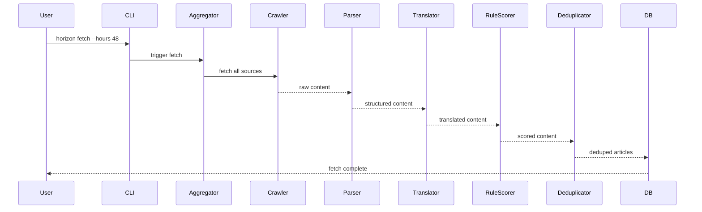

# 技术设计文档

Feature Name: daily-ai-news-aggregator
Created: 2026-03-28
Updated: 2026-03-28

## 1. 项目概述

### 1.1 项目简介

AI资讯聚合与翻译平台，从多个权威来源抓取AI相关资讯，自动翻译为中文，支持手动触发和定时抓取两种模式。

### 1.2 技术栈

| 组件 | 技术 | 版本 |
|------|------|------|
| 后端语言 | Python | 3.11+ |
| Web框架 | FastAPI | 0.100+ |
| 前端框架 | Next.js | 14+ |
| 数据库 | SQLite | 3 |
| 图表库 | ECharts | 5 |
| 爬虫框架 | httpx + BeautifulSoup | - |
| 定时任务 | APScheduler | - |
| RSS解析 | feedparser | - |
| 翻译API | googletrans / DeepL | - |

## 2. 系统架构

### 2.1 整体架构图

```mermaid
graph TB
    subgraph CLI["CLI Layer"]
        CLI["horizon CLI"]
    end
    
    subgraph API["Web API Layer"]
        FastAPI["FastAPI Server"]
    end
    
    subgraph Core["Core Business Layer"]
        Aggregator["Aggregator"]
        Crawler["Crawler"]
        Parser["Parser"]
        Translator["Translator"]
        RuleScorer["RuleScorer"]
        HotnessRanker["HotnessRanker"]
        Deduplicator["Deduplicator"]
    end
    
    subgraph Storage["Storage Layer"]
        DB["SQLite Database"]
        Config["config.json"]
    end
    
    subgraph Frontend["Frontend Layer"]
        NextJS["Next.js App"]
        ECharts["ECharts"]
    end
    
    CLI --> Core
    API --> Core
    Core --> Storage
    API --> Frontend
```

### 2.2 数据流程



## 3. 目录结构

```
daily-ai-news-aggregator/
├── horizon/                 # Python CLI应用
│   ├── __init__.py
│   ├── main.py             # CLI入口
│   ├── aggregator.py       # 聚合器
│   ├── crawlers/           # 爬虫模块
│   │   ├── __init__.py
│   │   ├── base.py         # 基类
│   │   ├── hackernews.py
│   │   ├── rss.py
│   │   ├── reddit.py
│   │   ├── github.py
│   │   ├── arxiv.py
│   │   ├── lobsters.py
│   │   └── youtube.py
│   ├── parser.py           # 解析器
│   ├── translator.py       # 翻译器
│   ├── scorer.py           # 规则评分器
│   ├── ranker.py           # 热度排名器
│   ├── deduplicator.py     # 去重器
│   ├── database.py         # 数据库
│   ├── config.py           # 配置
│   └── models.py           # 数据模型
├── web/                    # Next.js Web应用
│   ├── app/
│   │   ├── page.tsx       # 首页
│   │   ├── article/[id]/   # 文章详情
│   │   ├── trends/        # 趋势图表
│   │   └── api/           # API路由
│   ├── components/
│   └── package.json
├── data/                   # 数据目录
│   ├── config.json        # 配置文件
│   ├── horizon.db         # SQLite数据库
│   └── summaries/          # 每日摘要
├── tests/                  # 测试目录
│   ├── test_crawlers.py
│   ├── test_parser.py
│   ├── test_scorer.py
│   └── test_translator.py
├── pyproject.toml         # Python项目配置
├── package.json           # 前端项目配置
└── README.md
```

## 4. 数据模型

### 4.1 Article 模型

```python
class Article:
    id: str                    # UUID，唯一标识
    title: str                 # 标题（中文）
    title_raw: str             # 原始标题（英文）
    url: str                   # 原始URL
    url_normalized: str         # 规范化URL（去重用）
    summary: str               # 摘要
    content: str               # 正文（中文）
    content_raw: str           # 原始正文（英文）
    source: str                # 来源类型
    source_name: str           # 来源名称
    author: str                # 作者
    published_at: datetime     # 发布时间
    fetched_at: datetime       # 抓取时间
    score: float              # 规则评分 (0-10)
    hotness: float            # 热度分数
    engagement: Engagement     # 互动数据
    tags: List[str]           # 标签
    is_read: bool             # 是否已读
    is_archived: bool         # 是否已归档
    md5_hash: str             # 内容MD5哈希
```

### 4.2 Source 配置模型

```python
class Source:
    name: str                  # 来源名称
    type: SourceType          # 来源类型
    enabled: bool             # 是否启用
    url: str                  # 源URL
    auth_type: str            # 认证类型 (none/api_key/oauth2)
    auth_config: dict          # 认证配置
    weight: float             # 来源权重 (0-10)
    timeout: int              # 超时时间(秒)
    retry_times: int          # 重试次数
```

### 4.3 数据库Schema

```sql
CREATE TABLE articles (
    id TEXT PRIMARY KEY,
    title TEXT NOT NULL,
    title_raw TEXT,
    url TEXT UNIQUE NOT NULL,
    url_normalized TEXT,
    summary TEXT,
    content TEXT,
    content_raw TEXT,
    source TEXT NOT NULL,
    source_name TEXT,
    author TEXT,
    published_at DATETIME,
    fetched_at DATETIME NOT NULL,
    score REAL DEFAULT 0,
    hotness REAL DEFAULT 0,
    engagement_comments INTEGER DEFAULT 0,
    engagement_likes INTEGER DEFAULT 0,
    engagement_shares INTEGER DEFAULT 0,
    tags TEXT,
    is_read INTEGER DEFAULT 0,
    is_archived INTEGER DEFAULT 0,
    md5_hash TEXT,
    created_at DATETIME DEFAULT CURRENT_TIMESTAMP,
    updated_at DATETIME DEFAULT CURRENT_TIMESTAMP
);

CREATE TABLE sources (
    id TEXT PRIMARY KEY,
    name TEXT UNIQUE NOT NULL,
    type TEXT NOT NULL,
    enabled INTEGER DEFAULT 1,
    url TEXT,
    auth_type TEXT DEFAULT 'none',
    auth_config TEXT,
    weight REAL DEFAULT 5.0,
    timeout INTEGER DEFAULT 30,
    retry_times INTEGER DEFAULT 3,
    failure_count INTEGER DEFAULT 0,
    last_fetched_at DATETIME,
    created_at DATETIME DEFAULT CURRENT_TIMESTAMP
);

CREATE TABLE summaries (
    id TEXT PRIMARY KEY,
    date DATE UNIQUE NOT NULL,
    content TEXT NOT NULL,
    article_count INTEGER DEFAULT 0,
    sources TEXT,
    created_at DATETIME DEFAULT CURRENT_TIMESTAMP
);

CREATE INDEX idx_articles_url ON articles(url_normalized);
CREATE INDEX idx_articles_published ON articles(published_at);
CREATE INDEX idx_articles_source ON articles(source);
CREATE INDEX idx_articles_score ON articles(score);
CREATE INDEX idx_articles_hotness ON articles(hotness);
```

## 5. 核心模块接口

### 5.1 Aggregator

```python
class Aggregator:
    def __init__(self, config: Config): ...
    
    async def fetch_all(self, hours: int = 24) -> List[Article]:
        """并发抓取所有启用的来源"""
        
    async def fetch_source(self, source: Source, hours: int) -> List[Article]:
        """抓取单个来源"""
        
    async def process_articles(self, articles: List[Article]) -> List[Article]:
        """处理文章：翻译、评分、去重"""
```

### 5.2 Crawler (基类)

```python
class BaseCrawler(ABC):
    def __init__(self, source: Source): ...
    
    @abstractmethod
    async def fetch(self, hours: int) -> List[RawContent]:
        """抓取内容"""
        
    def supports(self, source_type: SourceType) -> bool: ...

class HackerNewsCrawler(BaseCrawler):
    async def fetch(self, hours: int) -> List[RawContent]: ...

class RSSCrawler(BaseCrawler):
    async def fetch(self, hours: int) -> List[RawContent]: ...

class RedditCrawler(BaseCrawler):
    async def fetch(self, hours: int) -> List[RawContent]: ...
```

### 5.3 Translator

```python
class Translator:
    def __init__(self, config: Config): ...
    
    async def translate(self, text: str, source_lang: str = 'en', target_lang: str = 'zh') -> str:
        """翻译文本"""
        
    async def translate_article(self, article: Article) -> Article:
        """翻译整篇文章"""
```

### 5.4 RuleScorer

```python
class RuleScorer:
    KEYWORD_BONUS = {"突发": 2, "重磅": 2, "首发": 2, "breaking": 2, "exclusive": 2}
    LENGTH_BONUS = (1000, 10000, 1)  # min, max, bonus
    FRESHNESS_BONUS = 24  # hours, bonus
    
    def calculate(self, article: Article) -> float:
        """计算质量评分 (0-10)"""
```

### 5.5 HotnessRanker

```python
class HotnessRanker:
    WEIGHTS = {
        'source_authority': 0.30,
        'rule_score': 0.30,
        'recency': 0.25,
        'engagement': 0.15
    }
    
    def calculate(self, article: Article) -> float:
        """计算热度分数"""
        
    def apply_time_decay(self, base_score: float, hours_ago: int) -> float:
        """应用时间衰减：每24小时降低10%"""
```

### 5.6 Deduplicator

```python
class Deduplicator:
    SIMILARITY_THRESHOLD = 0.85
    
    def deduplicate(self, articles: List[Article]) -> List[Article]:
        """去重并返回唯一文章"""
        
    def normalize_url(self, url: str) -> str:
        """规范化URL"""
        
    def calculate_similarity(self, title1: str, title2: str) -> float:
        """计算标题相似度（编辑距离）"""
```

## 6. CLI命令

### 6.1 horizon fetch

```bash
horizon fetch [OPTIONS]

OPTIONS:
  --hours INT        时间窗口（小时），默认24
  --sources TEXT     逗号分隔的来源列表，如: hn,reddit,rss
  --no-translate     禁用翻译
  --verbose          详细输出
```

### 6.2 horizon digest

```bash
horizon digest [OPTIONS]

OPTIONS:
  --date DATE        日期（默认今天）
  --limit INT        文章数量限制，默认20
  --publish          发布到GitHub Pages
```

### 6.3 horizon stats

```bash
horizon stats [OPTIONS]

OPTIONS:
  --days INT         统计天数，默认7
  --format TEXT      输出格式：text/json，默认text
```

### 6.4 horizon wizard

```bash
horizon wizard
# 交互式配置向导
```

## 7. API接口

### 7.1 文章API

```
GET  /api/articles              # 获取文章列表
     ?page=1&limit=50
     &sort=hotness|time|score
     &source=hn,reddit
     &tag=LLM
     &date_from=2026-03-01
     &date_to=2026-03-28

GET  /api/articles/{id}         # 获取文章详情

GET  /api/articles/{id}/read   # 标记已读
```

### 7.2 统计API

```
GET  /api/stats                 # 获取统计数据
     ?days=7

GET  /api/trends               # 获取趋势数据
     ?days=30
```

### 7.3 来源API

```
GET  /api/sources               # 获取来源列表

PUT  /api/sources/{id}          # 更新来源配置

POST /api/sources/{id}/test     # 测试来源连接
```

## 8. 错误处理

### 8.1 错误码

| 错误码 | 描述 | 处理方式 |
|--------|------|----------|
| E001 | 来源抓取失败 | 记录日志，跳过该来源 |
| E002 | 翻译API超时 | 保留原文，继续处理 |
| E003 | 数据库写入失败 | 重试3次，记录错误 |
| E004 | 配置格式错误 | 输出错误信息并退出 |
| E005 | 来源连续失败 | 自动禁用并告警 |

### 8.2 日志级别

- ERROR: 来源失败、数据库错误
- WARNING: 来源禁用、存储空间警告
- INFO: 抓取进度、完成统计
- DEBUG: 详细内容调试

## 9. 配置示例

### config.json

```json
{
  "version": 1,
  "translation": {
    "provider": "google",
    "enabled": true,
    "timeout": 10
  },
  "sources": [
    {
      "name": "HackerNews",
      "type": "hackernews",
      "enabled": true,
      "weight": 8.0,
      "timeout": 30
    },
    {
      "name": "Reddit ML",
      "type": "reddit",
      "enabled": true,
      "url": "r/machinelearning",
      "weight": 7.0,
      "auth_type": "api_key",
      "auth_config": {
        "client_id": "xxx",
        "client_secret": "xxx"
      }
    }
  ],
  "scoring": {
    "keywords": {
      "突发": 2, "重磅": 2, "首发": 2,
      "breaking": 2, "exclusive": 2
    },
    "length_bonus": {
      "min": 1000, "max": 10000, "score": 1
    },
    "freshness_hours": 24,
    "freshness_bonus": 2
  },
  "scheduler": {
    "enabled": false,
    "cron": "0 8 * * *",
    "timezone": "Asia/Shanghai"
  }
}
```

## 10. 部署

### 10.1 环境要求

- Python 3.11+
- Node.js 18+
- SQLite 3

### 10.2 安装

```bash
# 后端
cd horizon
pip install -e .

# 前端
cd web
npm install
```

### 10.3 启动

```bash
# 后端API
uvicorn horizon.main:app --reload

# 前端
cd web && npm run dev
```
